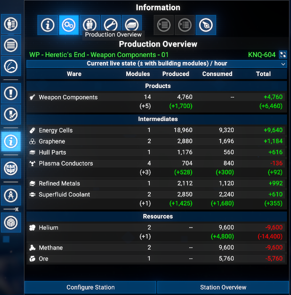
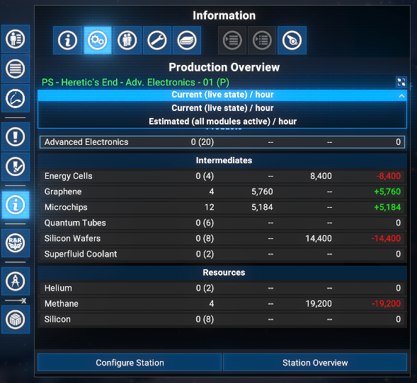
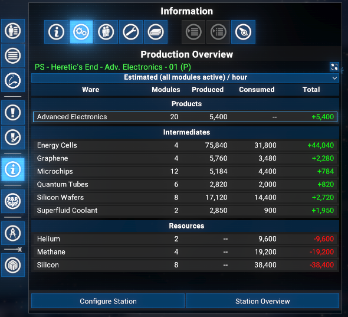

# Station Production Overview

Adds a **Production Overview** tab to the info panel tab strip in the map menu (alongside Object Info, Crew, etc.) for player-owned stations. Shows per-ware production and consumption rates, groups wares into Products, Intermediates, and Resources, and previews the impact of planned (not yet built) modules.

## Features

- **Production Overview Tab**: A dedicated tab in the station info panel shows all production and consumption data at a glance.
- **Per-ware rates**: For each ware the tab displays produced, consumed, and net total amounts per hour.
- **Live vs Estimated mode**: A dropdown lets you switch between *Current (live state)* (reflecting only active modules and workforce) and *Estimated (all modules active)* (the theoretical maximum output).
- **Active module count**: In live mode the module count column shows how many modules are currently running out of the total installed (e.g. `3 (5)`).
- **Ware grouping**: Wares are grouped into **Products** (not consumed on-site), **Intermediates** (produced and consumed on-site), and **Resources** (pure inputs, not produced on-site).
- **Planned module preview**: When the construction plan contains new modules a second delta row per ware shows the expected impact once those modules are built.
- **Quick-navigation buttons**: *Configure Station* and *Station Overview* buttons are available at the bottom of the tab.

## Requirements

- **X4: Foundations**: Version **9.00 beta 3** or higher.
- **UI Extensions and HUD**: Version **v9.0.0.0.3** or higher by [kuertee](https://next.nexusmods.com/profile/kuertee?gameId=2659).
  - Available on Nexus Mods: [UI Extensions and HUD](https://www.nexusmods.com/x4foundations/mods/552)
- **Mod Support APIs**: Version 1.95 or higher by [SirNukes](https://next.nexusmods.com/profile/sirnukes?gameId=2659).
  - Available on Steam: [SirNukes Mod Support APIs](https://steamcommunity.com/sharedfiles/filedetails/?id=2042901274)
  - Available on Nexus Mods: [Mod Support APIs](https://www.nexusmods.com/x4foundations/mods/503)

## Installation

- **Steam Workshop**: will be available later, after public release of game version 9.00
- **Nexus Mods**: [Station Production Overview](https://www.nexusmods.com/x4foundations/mods/2049)

## Usage

Open the map, select a player-owned station, and click the **Production Overview** tab in the info panel on the left or right side.

### Production Overview Tab

The tab renders a table with one row per ware that is produced or consumed by the station's production and processing modules.

### Live vs Estimated mode

Use the dropdown at the top of the tab to switch between two display modes:

- **Current (live state) / hour**: uses the actual running rate from the engine, accounting for modules that are idle due to missing resources or workforce shortages. The Modules column shows `active (total)` when not all modules are running.
- **Estimated (all modules active) / hour**: reports the theoretical rate assuming all installed modules run at full capacity with the current workforce bonus applied.

### Planned module preview

If the station's construction plan contains new production or processing modules that have not been built yet, a secondary delta row appears directly below the ware row. It shows:

- `(+N)` in the Modules column: the number of planned new modules
- The additional production/consumption contribution those modules would add once built

### Ware groups

Wares are organized into three groups:

- **Products**: wares produced at this station that are not also consumed as a resource by any other module here.
- **Intermediates**: wares that are both produced and consumed internally (e.g. a station that refines ore into silicon and then uses that silicon further).
- **Resources**: wares consumed as raw inputs that are not produced on-site.

## Credits

- **Author**: Chem O`Dun, on [Nexus Mods](https://next.nexusmods.com/profile/ChemODun/mods?gameId=2659) and [Steam Workshop](https://steamcommunity.com/id/chemodun/myworkshopfiles/?appid=392160)
- *"X4: Foundations"* is a trademark of [Egosoft](https://www.egosoft.com).

## Acknowledgements

- [EGOSOFT](https://www.egosoft.com) - for the X series.
- [kuertee](https://next.nexusmods.com/profile/kuertee?gameId=2659) - for the `UI Extensions and HUD` that makes this extension possible.
- [SirNukes](https://next.nexusmods.com/profile/sirnukes?gameId=2659) — for the `Mod Support APIs` that power the UI hooks.

## Changelog

### [9.00.02] - 2026-03-31

- **Fixed**
  - Disappearing the info menu on a right panel when this mod enabled tab is selected

### [9.00.01] - 2026-03-30

- **Added**
  - Initial public version
