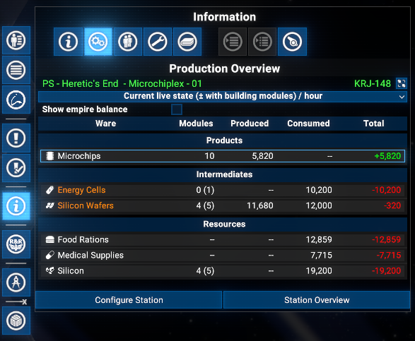
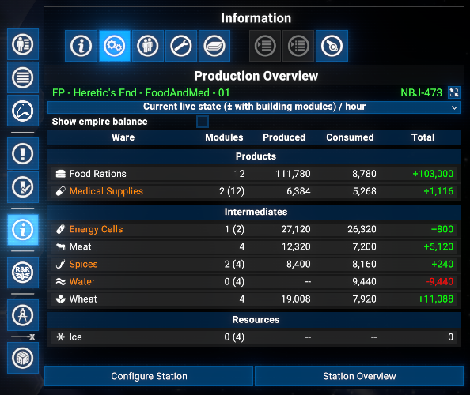
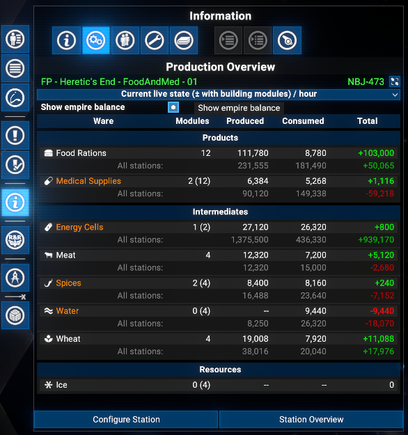
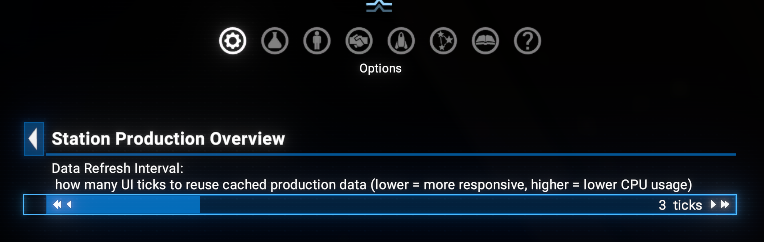
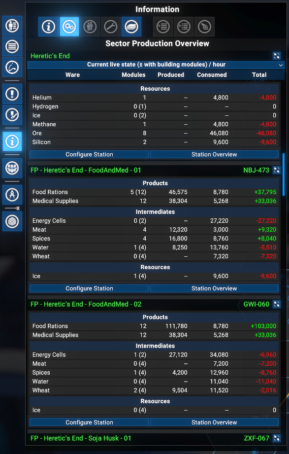

# Station Production Overview

Adds a **Production Overview** tab to the info panel tab strip in the map menu (alongside Object Info, Crew, etc.) for player-owned stations. Shows per-ware production and consumption rates, groups wares into Products, Intermediates, and Resources, and previews the impact of planned (not yet built) modules.

## Features

- **Production Overview Tab**: Dedicated tab in the station info panel showing per-ware produced, consumed, and net total rates per hour.
- **Sector Production Overview**: Same tab in the sector info panel, listing all player-owned production stations in the sector.
- **Ware grouping**: Wares split into **Products**, **Intermediates**, and **Resources**; workforce-only consumer goods placed in Resources unless also produced on-site.
- **Live vs Estimated mode**: Dropdown switches between actual running rates (with `active/total` module count) and theoretical maximum output.
- **Production issue indicators**: Wares with modules waiting on resources or storage are highlighted, with a tooltip showing exact issue counts.
- **Planned module preview**: A delta row per ware shows the production impact of unbuilt modules in the construction plan.
- **Empire balance**: Optional *All stations:* sub-row (toggle via **Show empire balance** checkbox, single-station view only) shows empire-wide production, consumption, and coloured surplus/deficit for each Product and Intermediate.
- **Configurable data refresh**: Slider in **Extension options > Station Production Overview** sets the cache duration in UI ticks (1-10, default 3).
- **Quick-navigation buttons**: *Configure Station* and *Station Overview* at the bottom of the tab.

## Requirements

- **X4: Foundations**: Version **8.00HF4** or higher and **UI Extensions and HUD**: Version **v8.0.4.3** or higher by [kuertee](https://next.nexusmods.com/profile/kuertee?gameId=2659).
  - Available on Nexus Mods: [UI Extensions and HUD](https://www.nexusmods.com/x4foundations/mods/552)
- **X4: Foundations**: Version **9.00 beta 3** or higher and **UI Extensions and HUD**: Version **v9.0.0.0.3** or higher by [kuertee](https://next.nexusmods.com/profile/kuertee?gameId=2659).
  - Available on Nexus Mods: [UI Extensions and HUD](https://www.nexusmods.com/x4foundations/mods/552)
- **Mod Support APIs**: Version 1.95 or higher by [SirNukes](https://next.nexusmods.com/profile/sirnukes?gameId=2659).
  - Available on Steam: [SirNukes Mod Support APIs](https://steamcommunity.com/sharedfiles/filedetails/?id=2042901274)
  - Available on Nexus Mods: [Mod Support APIs](https://www.nexusmods.com/x4foundations/mods/503)

## Installation

- **Steam Workshop**: [Station Production Overview](https://steamcommunity.com/sharedfiles/filedetails/?id=3695609478) - only for **Game version 8.00** with latest Steam version of the `UI Extensions and HUD` mod (version 80.43 from April 8).
- **Nexus Mods**: [Station Production Overview](https://www.nexusmods.com/x4foundations/mods/2049)

## Usage

Open the map, select a player-owned station, and click the **Production Overview** tab in the info panel (left or right side).

### Live vs Estimated mode

The dropdown switches between **Current (live state)** (actual running rates; Modules column shows `active/total`) and **Estimated (all modules active)** (theoretical maximum with workforce bonus).

### Ware groups

- **Products**: produced here, not consumed on-site.
- **Intermediates**: produced and consumed internally.
- **Resources**: consumed as inputs, not produced on-site.

Workforce-only consumer goods (food, medicine, etc.) also appear here unless produced on-site (from version 9.00.08).

### Planned module preview

If the construction plan has unbuilt modules, a delta row per ware shows `(+N)` planned modules and their additional production/consumption.

### Empire balance

Enable the **Show empire balance** checkbox (single-station view only) to show an *All stations:* sub-row per Product/Intermediate with empire-wide production, consumption, and a coloured balance (green = surplus, red = deficit). Respects Live / Estimated mode.

### Extensions options

**Options Menu > Extension options > Station Production Overview**:

- **Data Refresh Interval** (1-10, default 3): UI ticks to reuse cached data before recomputing. Lower = more responsive, higher = less CPU.

### Sector Production Overview

Select a sector in the map to get the same **Production Overview** tab listing all player-owned production stations in that sector.

## Credits

- **Author**: Chem O`Dun, on [Nexus Mods](https://next.nexusmods.com/profile/ChemODun/mods?gameId=2659) and [Steam Workshop](https://steamcommunity.com/id/chemodun/myworkshopfiles/?appid=392160)
- *"X4: Foundations"* is a trademark of [Egosoft](https://www.egosoft.com).

## Acknowledgements

- [EGOSOFT](https://www.egosoft.com) - for the X series.
- [kuertee](https://next.nexusmods.com/profile/kuertee?gameId=2659) - for the `UI Extensions and HUD` that makes this extension possible.
- [SirNukes](https://next.nexusmods.com/profile/sirnukes?gameId=2659) — for the `Mod Support APIs` that power the UI hooks.

## Changelog

### [9.00.08] - 2026-04-19

- **Added**
  - Workforce resource consumption: food, medicine, and other wares consumed only by workforce now appear in the Resources group.
  - Empire balance: an optional *All stations:* sub-row shows empire-wide production and consumption for each Product and Intermediate ware with a coloured surplus/deficit balance. Available in single-station view only.
- **Improved**
  - Data cache throttle: expensive C API calls are reused for `dataRefreshInterval` UI ticks before recomputing. Configurable in the Extensions options menu (default 3, range 1-10).

### [9.00.07] - 2026-04-10

- **Improved**
  - Added possibility to be distributed via Steam after upgrade Steam version the `UI Extensions and HUD` mod.

### [9.00.06] - 2026-04-06

- **Improved**
  - Added possibility to work under the v.8.00 of the game in case of usage the 8.0.4.3 version of the `UI Extensions and HUD` mod.

### [9.00.05] - 2026-04-02

- **Fixed**
  - Production overview table used too-small font for ware names and module counts on higher screen resolutions. Introduced in v9.00.04.

### [9.00.04] - 2026-04-01

- **Improved**
  - Ware icon is now displayed next to the ware name in each row.
  - Production issue highlighting: if any modules for a ware are waiting for resources or waiting for storage the ware name changes to warning colour and a mouseover tooltip shows the counts per issue state.

### [9.00.03] - 2026-03-31

- **Added**
  - **Sector Production Overview**: A new tab in the sector info panel that lists all player-owned production stations in the sector with their production data, equal to the single station production overview.

### [9.00.02] - 2026-03-31

- **Fixed**
  - Disappearing the info menu on a right panel when this mod enabled tab is selected

### [9.00.01] - 2026-03-30

- **Added**
  - Initial public version
